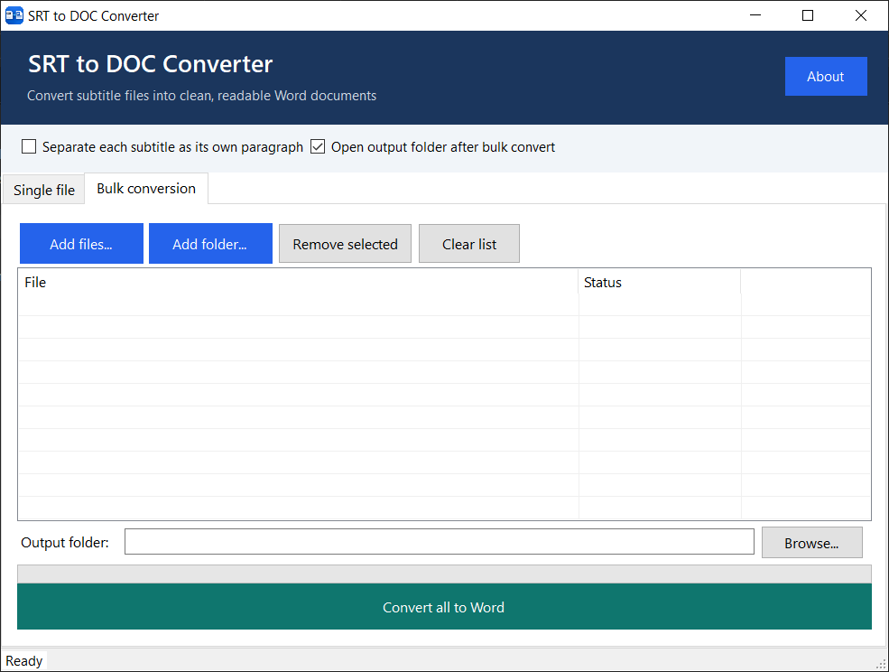
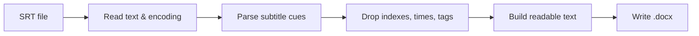

<p align="center">
  
  
  
  
</p>
<h1 align="center">SRT to DOC Converter</h1>

<p align="center">
  <strong>Turn movie, series, and YouTube subtitle files into clean, readable Word documents.</strong><br>
  Desktop app for Windows — convert one file, or hundreds at once.
</p>

<p align="center">
  <a href="#features">Features</a> •
  <a href="#how-to-use">How to use</a> •
  <a href="#bulk-conversion">Bulk conversion</a> •
  <a href="#build-from-source">Build</a> •
  <a href="#license">License</a>
</p>



## Why this exists

`.srt` files are made for video players, not for reading. They are full of cue numbers, timestamps, and markup:

```srt
1
00:00:01,000 --> 00:00:04,200
Welcome to the show.

2
00:00:04,200 --> 00:00:07,800
<i>Tonight we go back to the beginning.</i>
```

This app strips all of that away and writes a proper **`.docx`** file you can open in Microsoft Word, Google Docs, or LibreOffice.

---

## Features

| | |
| :--- | :--- |
| **Single-file conversion** | Open or drop an `.srt` file, preview the text, convert, and save as Word. |
| **Bulk conversion** | Queue many files or an entire folder (including subfolders) and convert them in one pass. |
| **Real SRT parsing** | Removes indexes, timestamps, and HTML-style tags such as `<i>` and `<b>`. |
| **True Word output** | Saves native `.docx` documents, not a renamed text file. |
| **Drag and drop** | Drop files onto the preview or onto the bulk list. Folders work too. |
| **Encoding support** | Reads UTF-8 and Windows-1250 subtitle files. |
| **Readable layout** | Optional setting to put each subtitle in its own paragraph. |
| **Progress and status** | See which files succeeded or failed during a bulk run. |

---
## How to use

### Single file

1. Start **SRT to DOC Converter**.
2. Open the **Single file** tab.
3. Click **Open SRT…** or drop an `.srt` file into the preview.
4. Click **Convert**.
5. Click **Save as Word…** and choose where to store the `.docx` file.

### Bulk conversion

1. Open the **Bulk conversion** tab.
2. Add files with **Add files…**, scan a folder with **Add folder…**, or drop files/folders onto the list.
3. Choose an **output folder** (by default a `Converted` folder next to the first file).
4. Click **Convert all to Word**.
5. Watch progress in the list. When it finishes, the output folder can open automatically.

> **Tip:** Enable **Separate each subtitle as its own paragraph** if you want a script-style document instead of one continuous block of text.

---

## Requirements

- Windows 10 or later
- [.NET 8 Desktop Runtime](https://dotnet.microsoft.com/download/dotnet/8.0) (needed if you run the built `.exe` without Visual Studio)

---

## Build from source

**Visual Studio**

1. Open `Srt to Doc Converter.sln`.
2. Build the solution (`Ctrl+Shift+B`).
3. Run with `F5`.

**Command line**

```bash
dotnet build "Srt to Doc Converter.csproj" -c Release
```

The executable is written to:

```text
bin/Release/net8.0-windows/Srt to Doc Converter.exe
```

---

## How conversion works



Each subtitle block is treated as a cue. Only spoken text is kept. Duplicate files are skipped in the bulk queue, and existing Word files in the output folder are not overwritten — a numbered copy is created instead.

---
## Project layout

```text
SrtConverter.cs        SRT parsing and text cleanup
SubtitleFileReader.cs  File loading and encoding
DocxWriter.cs          Word document generation
Form1.cs               Single-file and bulk UI
```

---

## License

This project is released under the [MIT License](LICENSE).

# Update - 07-Sep-2026
- Updated UI and added bulk conversion.
